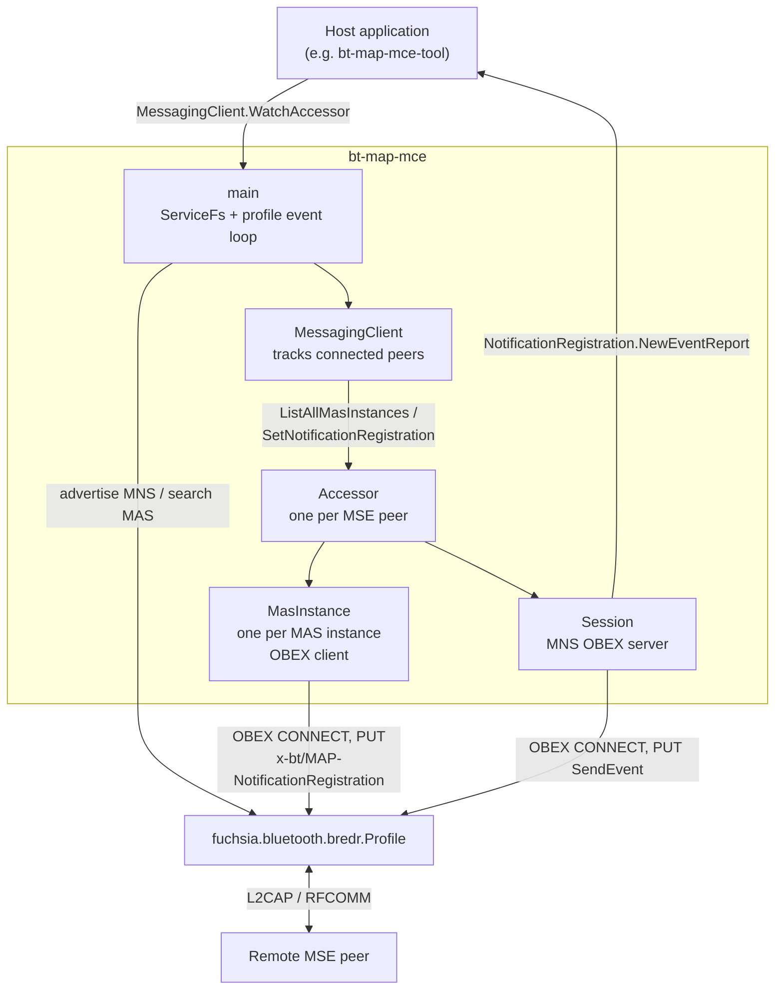

# Bluetooth Profile: Message Access Profile Message Client Equipment

This component implements the **Message Client Equipment (MCE)** role of the
[Bluetooth MAP v1.4.2 Specification][map-spec-link].

[map-spec-link]:
  https://www.bluetooth.com/specifications/specs/message-access-profile-1-4-2/

The MCE component enables Fuchsia devices to interact with mobile phones
or other **Message Server Equipment (MSE)** devices to access messages and
receive notifications of incoming messages over Bluetooth.

> [!NOTE]
> **Production Readiness & Specification Compliance**
>
> Per MAP v1.4.2 Section 4 (Table 4.1, Condition C.1), an MCE device is
> required to support **at least one** of the `Notification` or `Browsing`
> features.
>
> - **Notification-Only MCE Role (Production-Ready):**
>   The component fully implements all mandatory MCE requirements for the
>   `Notification` (Section 4.1) and `Notification Registration` (Section
>   4.5) features: SDP discovery (Section 7.1), OBEX MAS connection &
>   registration (Section 5.2 & Section 6.4.1), MNS OBEX server for
>   `SendEvent` (Section 5.1 & Section 6.4.4), XML EventReport parsing
>   (Section 3.1.7), and FIDL relaying. It is **spec-compliant** and ready for
>   product use cases that only require incoming message notifications.
>
> - **Optional Spec Features (Future Follow-Up Work):**
>   Features such as Message Content Retrieval (`GetMessage`, Section 5.6,
>   Table 4.3), Browsing (`SetFolder`, `GetFolderListing`,
>   `GetMessagesListing`, Section 4.2 & Sections 5.3-5.5), and Uploading
>   (`PushMessage`, Section 4.3 & Section 5.8) are **optional** for MCE
>   under the MAP v1.4.2 specification (Table 4.1) and can be implemented as
>   follow-up work if product requirements expand.

---

## Architecture Overview



The MCE component acts in two OBEX roles:
- **OBEX Client for Message Access Service (MAS):** Initiates OBEX
  connections to remote MSE peers to query MAS instance configurations
  and toggle notification registration.
- **OBEX Server for Message Notification Service (MNS):** Advertises MNS
  via SDP (`0x1133`) and accepts incoming OBEX connections from remote MSE
  peers to receive real-time message event reports.

It exposes the [`fuchsia.bluetooth.map`][map-fidl-link] FIDL interface to host
applications and tools.

[map-fidl-link]:
  https://fuchsia.googlesource.com/fuchsia/+/HEAD/sdk/fidl/fuchsia.bluetooth.map/

---

## Implementation Status (Spec & Design Doc vs. Codebase)

The table below summarizes feature implementation status against MAP v1.4.2
Section 4 and the Sapphire MAP MCE design document (`map-mce-dd.pdf`):

| Feature / Capability | Spec Sec | MCE Req | Status |
| :--- | :--- | :--- | :--- |
| **SDP Discovery** | Sec 7.1 | Mandatory | Implemented |
| **MAS OBEX Connection** | Sec 6.4 | Mandatory | Implemented |
| **Notification Registration** | Sec 4.5 | Mandatory (if Notif) | Implemented |
| **MNS Server & Events** | Sec 4.1 | Mandatory (if Notif) | Implemented |
| **Event Parsing (v1.0/1)** | Sec 3.1.7 | Mandatory (if Notif) | Implemented |
| **FIDL Event Relay** | N/A | Fuchsia Arch | Implemented |
| **Message Details & Fetch** | Sec 4.2 | Optional | Pending |
| **Folder Browsing** | Sec 4.2 | Conditional (C.1) | Pending |
| **Message Uploading** | Sec 4.3 | Optional | Pending |
| **Owner Status / Presence** | Sec 4.3 | Optional | Pending |
| **Extended Events 1.2** | Sec 3.1.7.3 | Optional | Pending |
| **Conversation Listing** | Sec 3.1.9 | Optional | Pending |
| **Notification Filtering** | Sec 4.1 | Optional | Pending |

### Implemented Code Locations
- **SDP Discovery:** [`src/profile.rs`](src/profile.rs)
- **Peer & FIDL Service Management (`MessagingClient`, `Accessor`):**
  [`src/messaging_client.rs`](src/messaging_client.rs)
- **MAS OBEX Connection:**
  [`src/message_access_service.rs`](src/message_access_service.rs)
- **Notification Registration:**
  [`src/message_access_service.rs`](src/message_access_service.rs)
- **MNS OBEX Server:**
  [`src/message_notification_service.rs`](src/message_notification_service.rs)
- **FIDL Protocol:** [`mce.fidl`][mce-fidl-link]

[mce-fidl-link]:
  https://fuchsia.googlesource.com/fuchsia/+/HEAD/sdk/fidl/fuchsia.bluetooth.map/mce.fidl

---

## Detailed Component Capabilities

### Currently Implemented
1. **Service Registration & Peer Connection:**
   - Registers MNS SDP record (Section 7.1.2) and searches for remote MAS
     SDP records (Section 7.1.1).
   - Parses MAS instance configuration (`MasConfig`), supported message
     types, and feature bits (`MapSupportedFeatures`).
2. **Notification Registration:**
   - Sends OBEX `PUT` requests (`x-bt/MAP-NotificationRegistration`,
     Section 5.2) to enable or disable event notifications on remote MAS
     instances.
3. **Event Notification Delivery:**
   - Runs an MNS OBEX server (Section 6.4.4) to receive event reports
     (`NewMessage`, `DeliverySuccess`, `SendingSuccess`, `DeliveryFailure`,
     `SendingFailure`, `MessageDeleted`, `MessageShift`,
     `ReadStatusChanged`, Section 3.1.7).
   - Converts event reports into FIDL [`Notification`][types-fidl-link]
     structures and delivers them asynchronously via the
     [`NotificationRegistration`][mce-fidl-link] protocol.

[types-fidl-link]:
  https://fuchsia.googlesource.com/fuchsia/+/HEAD/sdk/fidl/fuchsia.bluetooth.map/types.fidl

### Optional Future Work
1. **Message Fetching & Details:**
   - Implement `GetMessage` OBEX call (Section 5.6) to fetch raw/bMessage
     content and complete `MessageController.GetDetails` FIDL
     implementation.
2. **Folder Navigation & Message Listing:**
   - Implement `SetFolder` (Section 5.3), `GetFolderListing` (Section 5.4),
     and `GetMessagesListing` (Section 5.5) OBEX operations.
   - Introduce `InstanceBrowser` FIDL protocol to browse virtual folders
     (`inbox`, `sent`, `outbox`, `deleted`, `draft`).
3. **Message Uploading:**
   - Implement OBEX `PushMessage` (Section 5.8) for uploading or sending
     messages from MCE.
4. **Advanced Profile Features:**
   - Support Event Report Version 1.2 (Section 3.1.7.3), Conversation
     Listing (Section 3.1.9 & Section 5.13), and Notification Filtering
     (Section 5.14).

---

## Building and Testing

### Including Component in Build
Add the profile and unit tests to your Fuchsia build configuration:

```bash
fx set <config> --with //src/connectivity/bluetooth/profiles/bt-map-mce:tests
```

### Running Unit Tests
Execute the component's unit test suite:

```bash
fx test bt-map-mce-unittests
```

### Component & Manual Testing
For manual testing and interactive FIDL commands, see the
[`bt-map-mce-tool` documentation](../../tools/bt-map-mce-tool/README.md).
